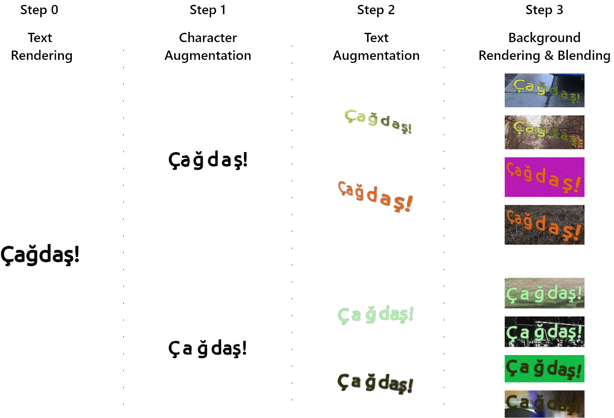
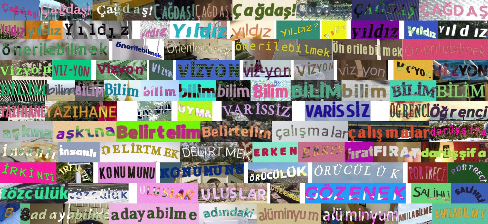

# !Paper! STS-TR: Synthetic Turkish Scene Text Recognition Dataset

<font size='3'> <p align="center">
    <a href='https://scholar.google.com/citations?user=sl1KrkYAAAAJ&hl=tr'> Serdar Yıldız* </a> 
</p></font>

<p align="center">
    <a href='https://www.kaggle.com/datasets/serdaryildiz/synthetic-turkish-scene-text-recognition-dataset'></a> 
</p>

<p align="center">
    <a href='https://www.sciencedirect.com/science/article/pii/S2215098624002672'></a>
    <a href="https://creativecommons.org/licenses/by-nc/4.0/"></a>
</p>


---
## Overview

The Synthetic Turkish Scene Text Recognition (STS-TR) dataset is a comprehensive synthetic dataset created to complement the real-world Turkish Scene Text Recognition (TS-TR) dataset, featuring over 12 million synthetic samples designed to simulate various textual scenarios. It includes a wide array of Turkish words and phrases rendered in diverse fonts, sizes, and orientations on generic background scenes with added realistic effects like shadows, blurs, and environmental distortions. This dataset enhances training data availability for models, particularly those focusing on the Turkish language.



*Figure 1: MViT-TR architecture.*


---
## Installation

To set up MViT-TR for training and evaluation, follow these steps:

1. **Clone the repository:**
   ```bash
   git clone https://github.com/serdaryildiz/STS-TR.git
   cd STS-TR

2. **Install required dependencies:**
    ```bash
    pip install -r requirements.txt

3. Adjust sources folder. 
    ```bash
      .
      ├── background
      │   └── val2017
      ├── fonts
      ├── text
      └── textures
          └── dtd
              └── images

4. Run `main.py`
   
    ```bash
    python main.py

---

## Examples 



*Figure 1: Samples from STS-TR dataset.*

---

## Citation

If you find this work useful, please cite our paper:

```bibtex
@article{YILDIZ2024101881,
title = {Turkish scene text recognition: Introducing extensive real and synthetic datasets and a novel recognition model},
journal = {Engineering Science and Technology, an International Journal},
volume = {60},
pages = {101881},
year = {2024},
issn = {2215-0986},
doi = {https://doi.org/10.1016/j.jestch.2024.101881},
url = {https://www.sciencedirect.com/science/article/pii/S2215098624002672},
author = {Serdar Yıldız},
keywords = {Scene text recognition dataset, Synthetic scene text recognition dataset, Patch masking, Position attention, Vision transformers},
}
```


---
## Download

### [Kaggle](https://www.kaggle.com/datasets/serdaryildiz/synthetic-turkish-scene-text-recognition-dataset)

